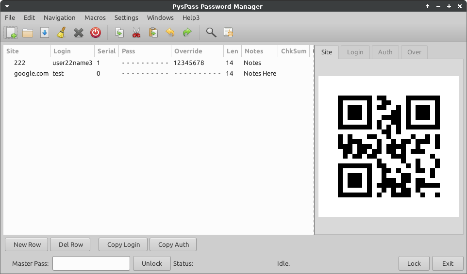

# pyspass

## Password manager

Under construction. DO NOT USE.

## Password generator / manager

A python / PyGObject version of the popular password manager concept.

 Generates passes from Site / Login / Serial / Master Pass

SHA512 strong, no passes are saved, only site, site login and serial is saved.

 Pass is displayed as a QR code. (For your eyes only)
 The default tab is for site, the pass QR is not shown unless 'Auth' is selected.

