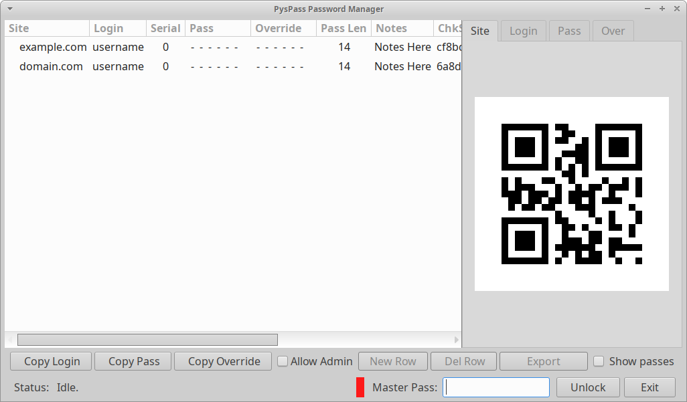

# The Python Simple Password manager

pyspass, a Python / PyGObject version of the popular password manager concept.

 Generate / Store site passwords and logins. This program will
securely manage all your logins. It can also generate site credentials for you
by using the minimal information necessary to do so.

## Trust

 The program is open sourced, so you may look at its source code, understand
its workings, and verify that no 'oversight' is present to leak your
confidential information.

## Password generator / manager, how it works

 PysPass generates passes from:

        Site Address // Login Name // Serial Number // Master Pass

 You may enter a password override if the generated password is not
satisfactory. The override is saved encrypted, using state of the art AES
encryption.

## Release one

The fundamentals are working. Pass generation, override, editing, export
are all functional.
SHA256 strong. No passes are saved, only site, site login name and
serial number is saved.
 The hashes are calculated at the time of master pass entry, and compared
to the checksum field. This assures that there are no sensitive items stored.
 The only item that cannot be calculated is the pass override. (custom pass)
that is stored with AES encryption.

## The QR codes

 Information is displayed as a QR code. (For your eyes only)
The default tab is for the site, the pass QR is not shown unless
the master pass is successfully entered and the  'Auth' tab is selected.

## Safety, security

  The SHA256 hash algorithm is considered unbreakable, and the AES encryption
is also unbreakable as in 2024. Because only the hashes are stored, no
comprizable items are saved.

We selected 14 letter long pass as default. Below a table of
difficulty for breaking. You may override the pass length dynamically.
The relevant table column is the:

    "Numbers Upper and Lower case letter and symbols.

  We use a limited set of symbols, for greater compatibility with sites.

  The serial number field is provided to modify the generated pass, in case
a new pass is required for the same site.

  The User Interface operates on hot keys that are chosen specifically to be
close to the left alt key. This allows the left hand to initiate quick actions
while driving the mouse with the right hand. The usage of the alt key
accelerators are optional, the UI is completely happy with any method of
operating it.

// EOF
