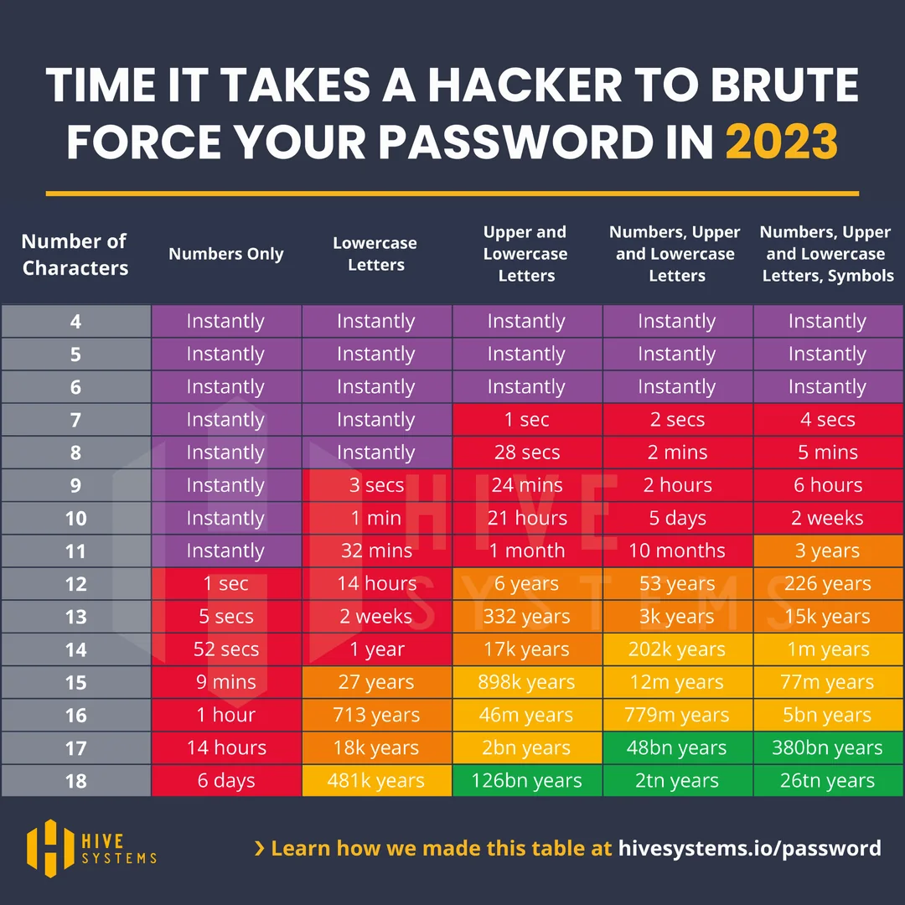

# pyspass

## Password manager

Under construction. DO NOT USE.

## Password generator / manager

A python / PyGObject version of the popular password manager concept.

 Generates passes from Site / Login / Serial / Master Pass

SHA256 strong. No passes are saved, only site, site login name and serial number is saved.

The hashes are calculated at the time of master pass entry, and compared
to the checksum field. This assures that there are no hackable items stored.

 Pass is displayed as a QR code. (For your eyes only)
The default tab is for the site, the pass QR is not shown unless 'Auth' is
selected.

 We selected 16 letter long pass as default. Below a table of
  difficulty for breaking

